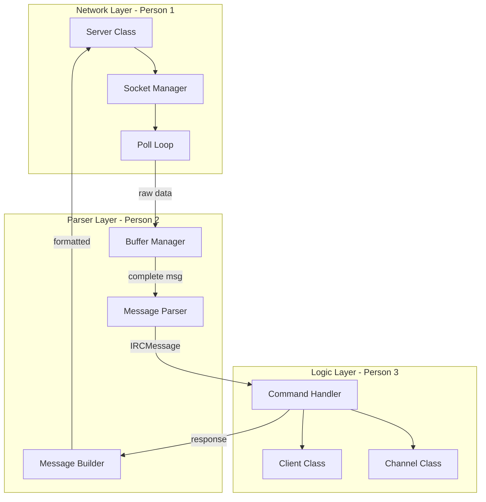

<!-- c8973302-81d8-458f-83ca-7c61db8b2e6a 40c8a93e-3b9c-4171-ba69-783a87cda7cb -->
# Development Plan: IRC Server (ft_irc)

## General Architecture



## Phase 0: Pre-Development Education (1 week)

Before writing code, each team member must study specific concepts. It's recommended to create a shared document where each person summarizes what they learned.

### Person 1 - Network Core

**Concepts to study:**

1. **TCP/IP Sockets**

   - What is a socket and how it works
   - Difference between TCP and UDP
   - The client-server model
   - Address families (AF_INET, AF_INET6)

2. **Socket System Calls**

   - `socket()` - create a socket
   - `bind()` - associate with an address/port
   - `listen()` - mark as server
   - `accept()` - accept connections
   - `send()/recv()` - send/receive data
   - `close()` - close connections

3. **I/O Multiplexing with poll()**

   - Why we need multiplexing (can't use threads/fork)
   - How `poll()` and `struct pollfd` work
   - Events: POLLIN, POLLOUT, POLLERR, POLLHUP
   - The main loop of a server

4. **Non-blocking I/O**

   - `fcntl(fd, F_SETFL, O_NONBLOCK)`
   - Handling EAGAIN/EWOULDBLOCK
   - Why it's necessary for poll()

5. **Byte Order**

   - Big endian vs little endian
   - `htons()`, `htonl()`, `ntohs()`, `ntohl()`

**Recommended resources:**

- Beej's Guide to Network Programming (mandatory)
- Man pages: socket(2), poll(2), fcntl(2)
- Video: "How do TCP Sockets Work?" - Computerphile

### Person 2 - IRC Parser

**Concepts to study:**

1. **IRC Protocol (RFC 1459 and RFC 2812)**

   - Message format: `[:<prefix>] <command> [<params>] [:<trailing>]`
   - What is the prefix (message origin)
   - Commands and their parameters
   - Numeric replies (001, 433, etc.)

2. **String Parsing in C++98**

   - `std::string` and its methods (find, substr, erase)
   - Manual tokenization (no split in C++98)
   - Handling CRLF delimiters (`\r\n`)

3. **Data Buffering**

   - Why data arrives fragmented (TCP is a stream)
   - How to accumulate data until a complete message
   - The subject test with `nc` and Ctrl+D

4. **IRC Response Format**

   - Structure of numeric replies
   - Standard error messages
   - How a real server responds (use irssi against a public server)

**Recommended resources:**

- RFC 1459 (sections 2.3 and 2.4)
- RFC 2812 (sections 2.3 - Message format)
- Connect to a real IRC server with irssi and observe traffic

### Person 3 - IRC Logic

**Concepts to study:**

1. **IRC Data Model**

   - What is a user/client in IRC
   - What is a channel and its properties
   - User modes and channel modes
   - Channel operators vs regular users

2. **Authentication Flow**

   - PASS, NICK, USER commands
   - Registration order
   - Welcome messages (001-004)

3. **Channel Management**

   - JOIN, PART, QUIT
   - How messages propagate to a channel
   - User list in a channel

4. **Operator Commands**

   - KICK, INVITE, TOPIC, MODE
   - Permissions needed for each
   - Modes: i, t, k, o, l

5. **Data Structures in C++98**

   - `std::map` for users by nickname/fd
   - `std::vector` for lists
   - `std::set` for channel members
   - Iterators and their usage

**Recommended resources:**

- RFC 2812 (sections 3 and 4 - Messages and Replies)
- Use irssi and test all required commands
- irssi documentation

---

## Phase 1: Project Setup and Interfaces

### File Structure

```
irc_server/
├── Makefile
├── includes/
│   ├── Server.hpp
│   ├── Client.hpp
│   ├── Channel.hpp
│   ├── Message.hpp
│   ├── Parser.hpp
│   ├── Commands.hpp
│   └── Utils.hpp
├── srcs/
│   ├── main.cpp
│   ├── network/
│   │   ├── Server.cpp
│   │   └── Socket.cpp
│   ├── parser/
│   │   ├── Parser.cpp
│   │   ├── Message.cpp
│   │   └── Buffer.cpp
│   ├── core/
│   │   ├── Client.cpp
│   │   ├── Channel.cpp
│   │   └── Commands.cpp
│   └── utils/
│       └── Utils.cpp
└── config/
    └── irc.conf (optional)
```

### Shared Interfaces (Define BEFORE splitting work)

The 3 people must agree on these structures before separating:

```cpp
// Message.hpp - Parsed message structure
struct IRCMessage {
    std::string prefix;      // Origin (optional)
    std::string command;     // NICK, JOIN, PRIVMSG, etc.
    std::vector<std::string> params;  // Parameters
    std::string trailing;    // Message after ':'
    
    std::string raw;         // Original message
};

// Client.hpp - Minimum client interface
class Client {
public:
    int getFd() const;
    std::string getNickname() const;
    std::string getUsername() const;
    bool isRegistered() const;
    bool isOperator(const std::string& channel) const;
    void appendToBuffer(const std::string& data);
    std::string& getBuffer();
    // ... more methods
};

// Channel.hpp - Minimum channel interface
class Channel {
public:
    std::string getName() const;
    bool hasClient(Client* client) const;
    bool isOperator(Client* client) const;
    void broadcast(const std::string& msg, Client* exclude = NULL);
    // ... more methods
};
```

---

## Phase 2: Parallel Development

### Person 1 - Network Core

**Responsibilities:**

- Server class (main socket, poll loop)
- Connection handling (accept, disconnect)
- Raw data send/receive
- Cross-platform Makefile

**Files:**

- `srcs/network/Server.cpp`
- `srcs/network/Socket.cpp`
- `srcs/main.cpp`
- `Makefile`

**Specific tasks:**

1. **Cross-platform Makefile**
```makefile
NAME = ircserv
CXX = c++
CXXFLAGS = -Wall -Wextra -Werror -std=c++98

# Detect OS
UNAME_S := $(shell uname -s)
ifeq ($(UNAME_S),Darwin)
    # MacOS
    CXXFLAGS += -D__MACOS__
endif
ifeq ($(UNAME_S),Linux)
    # Linux
    CXXFLAGS += -D__LINUX__
endif

# ... rest of Makefile
```

2. **Server Loop with poll()**

   - Create server socket
   - Configure non-blocking
   - Main loop with poll()
   - Handle new connections
   - Handle incoming data (pass to Parser)
   - Handle disconnections

**Inputs:** Configuration (port, password)

**Outputs:** Raw data received (string) + client fd

---

### Person 2 - Parser and Messages

**Responsibilities:**

- Buffering partial data
- IRC message parsing
- Response construction
- Numeric replies

**Files:**

- `srcs/parser/Parser.cpp`
- `srcs/parser/Message.cpp`
- `srcs/parser/Buffer.cpp`
- `includes/Message.hpp`
- `includes/Parser.hpp`

**Specific tasks:**

1. **Buffer Manager**

   - Accumulate data until CRLF found
   - Extract complete messages
   - Keep partial data

2. **Parser**

   - Parse IRC format: `[:<prefix>] <command> [params] [:<trailing>]`
   - Basic format validation
   - Return IRCMessage structure

3. **Message Builder**

   - Functions to build responses
   - Numeric replies (RPL_WELCOME, ERR_NICKNAMEINUSE, etc.)
   - Correct format with CRLF

**Inputs:** Raw string from network layer

**Outputs:** Parsed IRCMessage / Formatted string to send

---

### Person 3 - IRC Logic

**Responsibilities:**

- Client class (user state)
- Channel class (channel state)
- Command handlers
- Validations and permissions

**Files:**

- `srcs/core/Client.cpp`
- `srcs/core/Channel.cpp`
- `srcs/core/Commands.cpp`
- `includes/Client.hpp`
- `includes/Channel.hpp`
- `includes/Commands.hpp`

**Specific tasks:**

1. **Client Class**

   - State: fd, nickname, username, hostname, registered
   - Reception buffer
   - List of channels where present

2. **Channel Class**

   - Name, topic, modes
   - Member list
   - Operator list
   - Broadcast method

3. **Command Handlers** (one per command)

   - PASS, NICK, USER (authentication)
   - JOIN, PART, QUIT
   - PRIVMSG, NOTICE
   - KICK, INVITE, TOPIC, MODE
   - PING/PONG

**Inputs:** IRCMessage + Client reference

**Outputs:** List of responses (strings) to send

---

## Phase 3: Integration

Once each part works independently:

1. **Connect Network with Parser**

   - When data arrives, pass to buffer
   - When complete message, parse it

2. **Connect Parser with Logic**

   - Parsed message goes to command handler
   - Command handler returns responses

3. **Connect Logic with Network**

   - Responses sent via Server
   - Broadcasts to channels

---

## Phase 4: Testing

1. **Unit tests per module**

   - Parser: valid and invalid messages
   - Client: registration states
   - Channel: permissions and modes

2. **Integration tests with netcat**

   - Subject test (partial data)
   - Multiple simultaneous connections

3. **Tests with irssi**

   - Complete registration
   - All required commands
   - Error cases

---

## IRC Commands to Implement

| Command | Description | Priority |

|---------|-------------|----------|

| PASS | Connection password | High |

| NICK | Set nickname | High |

| USER | Set username | High |

| JOIN | Join channel | High |

| PART | Leave channel | High |

| QUIT | Disconnect | High |

| PRIVMSG | Private/channel message | High |

| NOTICE | Similar to PRIVMSG | Medium |

| KICK | Eject from channel | High |

| INVITE | Invite to channel | High |

| TOPIC | View/change topic | High |

| MODE | Change modes | High |

| PING/PONG | Keep-alive | High |

| WHO | User info | Low |

| WHOIS | User info | Low |

---

## Essential Numeric Replies

```
001 RPL_WELCOME
002 RPL_YOURHOST
003 RPL_CREATED
004 RPL_MYINFO
331 RPL_NOTOPIC
332 RPL_TOPIC
353 RPL_NAMREPLY
366 RPL_ENDOFNAMES
401 ERR_NOSUCHNICK
403 ERR_NOSUCHCHANNEL
431 ERR_NONICKNAMEGIVEN
432 ERR_ERRONEUSNICK
433 ERR_NICKNAMEINUSE
461 ERR_NEEDMOREPARAMS
462 ERR_ALREADYREGISTERED
464 ERR_PASSWDMISMATCH
473 ERR_INVITEONLYCHAN
475 ERR_BADCHANNELKEY
482 ERR_CHANOPRIVSNEEDED
```

---

## Suggested Timeline

| Week | Activity |

|------|----------|

| 1 | Phase 0: Individual study + meeting to define interfaces |

| 2-3 | Phase 2: Parallel development |

| 4 | Phase 3: Integration + debugging |

| 5 | Phase 4: Testing + bug fixes |

| 6 | Buffer for unforeseen issues + evaluation |

---

## Linux/Mac Compatibility Notes

1. **poll()** works the same on both systems
2. **fcntl()** with `O_NONBLOCK` is allowed on Mac
3. Avoid Linux-specific (epoll) or Mac-specific (kqueue) functions
4. Compile and test on both systems regularly
5. Use conditional compilation flags if necessary

### To-dos

- [ ] Compartir lectura base a cada integrante
- [ ] Acordar interfaz Red<->Protocolo
- [ ] Montar Makefile multiplataforma
- [ ] Implementar loop poll/kqueue y gestion clientes
- [ ] Implementar parser y comandos IRC
- [ ] Crear scripts/pruebas macOS/Linux