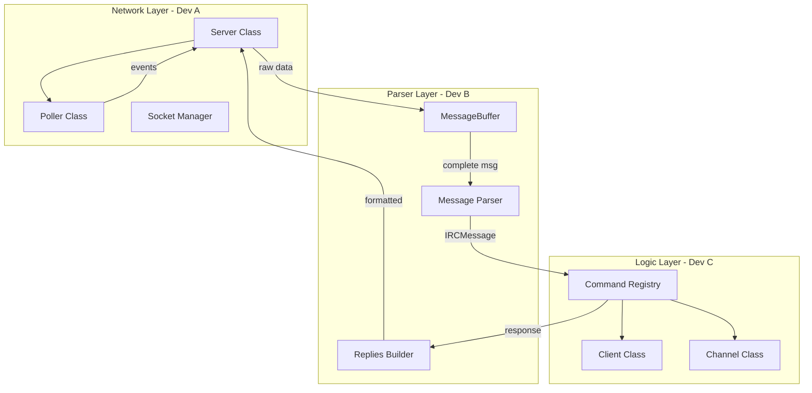

# Development Plan: IRC Server (ft_irc)

## General Architecture



---

## EPIC 0: Study Phase & Setup (Week 1-2)

### Study Phase - Network Core (Dev A)

**Duration:** 1 week  
**Status:** Must complete before starting EPIC 1

**Concepts to study:**

1. **TCP/IP Sockets**
   - What is a socket and how it works
   - Difference between TCP and UDP
   - The client-server model
   - Address families (AF_INET, AF_INET6)

2. **Socket System Calls**
   - `socket()` - create a socket
   - `bind()` - associate with an address/port
   - `listen()` - mark as server
   - `accept()` - accept connections
   - `send()/recv()` - send/receive data
   - `close()` - close connections
   - `setsockopt()` - configure socket options (SO_REUSEADDR)

3. **I/O Multiplexing with poll()**
   - Why we need multiplexing (can't use threads/fork)
   - How `poll()` and `struct pollfd` work
   - Events: POLLIN, POLLOUT, POLLERR, POLLHUP
   - The main loop of a server
   - **CRITICAL:** Only ONE poll() call in entire project

4. **Non-blocking I/O**
   - `fcntl(fd, F_SETFL, O_NONBLOCK)` - MacOS requirement
   - Handling EAGAIN/EWOULDBLOCK
   - Why it's necessary for poll()
   - Difference between blocking and non-blocking

5. **Byte Order**
   - Big endian vs little endian
   - `htons()`, `htonl()`, `ntohs()`, `ntohl()`
   - `inet_addr()`, `inet_ntoa()`, `inet_ntop()`

6. **Partial Data Handling**
   - TCP is a stream protocol
   - Data arrives fragmented
   - Need to buffer until complete message (`\r\n`)

**Recommended resources:**
- Beej's Guide to Network Programming (mandatory)
- Man pages: socket(2), poll(2), fcntl(2), send(2), recv(2)
- Video: "How do TCP Sockets Work?" - Computerphile

**Deliverable:** Summary document of learned concepts

---

### Study Phase - IRC Parser (Dev B)

**Duration:** 1 week  
**Status:** Must complete before starting EPIC 2

**Concepts to study:**

1. **IRC Protocol (RFC 1459 and RFC 2812)**
   - Message format: `[:<prefix>] <command> [<params>] [:<trailing>]\r\n`
   - What is the prefix (message origin)
   - Commands and their parameters
   - Numeric replies (001, 433, etc.)
   - CRLF delimiters (`\r\n`)

2. **String Parsing in C++98**
   - `std::string` and its methods (find, substr, erase)
   - Manual tokenization (no split in C++98)
   - Handling CRLF delimiters
   - Parsing with spaces and colons

3. **Data Buffering**
   - Why data arrives fragmented (TCP is a stream)
   - How to accumulate data until a complete message
   - The subject test with `nc` and Ctrl+D
   - Buffer management strategies

4. **IRC Response Format**
   - Structure of numeric replies: `:server 001 nick :Welcome message\r\n`
   - Standard error messages
   - How a real server responds (use irssi against a public server)
   - Message building helpers

**Recommended resources:**
- RFC 1459 (sections 2.3 and 2.4) - Message format
- RFC 2812 (sections 2.3 - Message format)
- Connect to a real IRC server with irssi and observe traffic
- Test with: `irssi -c irc.freenode.net -p 6667`

**Deliverable:** Summary document + test parser for simple messages

---

### Study Phase - IRC Logic (Dev C)

**Duration:** 1 week  
**Status:** Must complete before starting EPIC 3

**Concepts to study:**

1. **IRC Data Model**
   - What is a user/client in IRC
   - What is a channel and its properties
   - User modes and channel modes
   - Channel operators vs regular users

2. **Authentication Flow**
   - PASS, NICK, USER commands
   - Registration order (PASS → NICK → USER)
   - Welcome messages (001-004)
   - State machine for registration

3. **Channel Management**
   - JOIN, PART, QUIT
   - How messages propagate to a channel
   - User list in a channel
   - Channel modes: +i, +t, +k, +o, +l

4. **Operator Commands**
   - KICK, INVITE, TOPIC, MODE
   - Permissions needed for each
   - Mode flags: i (invite-only), t (topic-protected), k (key), o (operator), l (limit)

5. **Data Structures in C++98**
   - `std::map` for users by nickname/fd
   - `std::vector` for lists
   - `std::set` for channel members
   - Iterators and their usage
   - Memory management (pointers, ownership)

**Recommended resources:**
- RFC 2812 (sections 3 and 4 - Messages and Replies)
- Use irssi and test all required commands
- irssi documentation
- Test commands: `/join #test`, `/mode #test +i`, `/kick user`, etc.

**Deliverable:** Summary document + state diagram for registration

---

## EPIC 0: Setup & Rules

### Issue 0.1: Repo & Makefile (C++98 compliant)

**Type:** Chore  
**Area:** Infra  
**Priority:** P0  
**Owner:** Dev A  
**Status:** Backlog  
**Depends on:** Study Phase - Network Core (Dev A)

**Description:**
Create a cross-platform Makefile that compiles the IRC server with C++98 standard. The Makefile must detect the operating system (Linux/Mac) and set appropriate flags. It should avoid unnecessary relinking and work correctly on both platforms.

**Tasks:**
1. Review existing `Makefile` structure
2. Ensure C++98 compliance: `-Wall -Wextra -Werror -std=c++98`
3. Add OS detection using `uname -s`
4. Set platform-specific flags (`-D__MACOS__` or `-D__LINUX__`)
5. Configure source file discovery (wildcard for `src/*.cpp` and `src/commands/*.cpp`)
6. Set up object directory structure (`objs/` and `objs/commands/`)
7. Implement dependency tracking for headers
8. Test compilation on both Linux and Mac
9. Verify no unnecessary relinking occurs

**Acceptance Criteria:**
- ✅ Compiles with `-Wall -Wextra -Werror -std=c++98`
- ✅ Makefile detects OS (Linux/Mac) and sets flags (`-D__MACOS__` or `-D__LINUX__`)
- ✅ No unnecessary relinking (only recompiles changed files)
- ✅ Targets work: `all`, `clean`, `fclean`, `re`
- ✅ Works on both Linux and Mac
- ✅ Object files organized in `objs/` directory
- ✅ Header dependencies tracked correctly

**Files to modify:**
- `Makefile`

**Testing:**
```bash
# On Linux
make clean && make
# On Mac
make clean && make
# Verify no relink on second make
make
```

---

### Issue 0.2: Team conventions & module contracts

**Type:** Chore  
**Area:** Infra  
**Priority:** P0  
**Owner:** Dev B  
**Status:** Backlog  
**Depends on:** All Study Phases (Dev A, Dev B, Dev C)

**Description:**
Document team conventions and module contracts. Define clear interfaces between modules, establish rules for I/O operations, and document the parsed command structure. This document will serve as the contract for all team members.

**Tasks:**
1. Review existing `TEAM_CONVENTIONS.md`
2. Document: who calls `poll()` (only Poller class)
3. Document: how responses are sent to client (via `Server::sendToClient()`)
4. Document: format of parsed Command structure (`IRCMessage`)
5. Document: interfaces for `Client`, `Channel`, `Message`
6. Define module interaction flow
7. Document error handling conventions
8. Schedule team meeting to review and approve
9. Update `TEAM_CONVENTIONS.md` with all decisions

**Acceptance Criteria:**
- ✅ Documented: who calls `poll()` (only Poller class)
- ✅ Documented: how responses are sent to client (via `Server::sendToClient()`)
- ✅ Documented: format of parsed Command structure (`IRCMessage` with prefix, command, params, trailing)
- ✅ Documented: interfaces for `Client`, `Channel`, `Message`
- ✅ Team meeting notes shared in `TEAM_CONVENTIONS.md`
- ✅ All team members reviewed and approved conventions

**Files to modify:**
- `TEAM_CONVENTIONS.md`

**Key Conventions to Document:**

1. **Poll() Responsibility:**
   ```cpp
   // Only Poller class calls poll()
   // Other classes must NOT call poll(), select(), epoll(), or kqueue()
   ```

2. **Sending Responses:**
   ```cpp
   // All responses go through Server::sendToClient()
   // Commands should NOT directly write to socket
   server.sendToClient(clientFd, "PRIVMSG #channel :Hello\r\n");
   ```

3. **Parsed Command Structure:**
   ```cpp
   struct IRCMessage {
       std::string prefix;      // Optional origin
       std::string command;      // Command name
       std::vector<std::string> params;  // Parameters
       std::string trailing;     // Trailing parameter
       std::string raw;          // Original message
   };
   ```

4. **Client Interface:**
   - `getFd()`, `getNickname()`, `getUsername()`
   - `isRegistered()`, `hasPassword()`, `hasNickname()`, `hasUsername()`
   - `appendToBuffer()`, `getBuffer()`
   - `setNickname()`, `setUsername()`, `registerClient()`

5. **Channel Interface:**
   - `getName()`, `hasClient()`, `addClient()`, `removeClient()`
   - `isOperator()`, `addOperator()`, `removeOperator()`
   - `getTopic()`, `setTopic()`
   - `hasMode()`, `setMode()`
   - `broadcast()`, `broadcastFrom()`

---

## EPIC 1: Networking & Poll (Dev A)

### Issue 1.1: TCP server socket (bind/listen/accept)

**Type:** Feature  
**Area:** Net  
**Priority:** P0  
**Owner:** Dev A  
**Status:** Backlog  
**Depends on:** Issue 0.1, Issue 0.2

**Description:**
Implement the basic TCP server socket functionality. Create a server socket, bind it to a port, and listen for incoming connections. The server must be able to accept multiple clients simultaneously.

**Tasks:**
1. Implement `Server::createServerSocket()` in `src/Server.cpp`
   - Call `socket()` with AF_INET and SOCK_STREAM
   - Set socket options: `SO_REUSEADDR` using `setsockopt()`
   - Handle errors appropriately

2. Implement `Server::bindSocket()` in `src/Server.cpp`
   - Create `sockaddr_in` structure
   - Set address family, port (from Config), and address (INADDR_ANY)
   - Use `htons()` for port conversion
   - Call `bind()` with server socket
   - Handle errors (port already in use, etc.)

3. Implement `Server::listenSocket()` in `src/Server.cpp`
   - Call `listen()` with backlog (e.g., 10)
   - Handle errors

4. Implement `Server::start()` in `src/Server.cpp`
   - Call `createServerSocket()`
   - Call `bindSocket()`
   - Call `listenSocket()`
   - Add server socket to Poller
   - Set server socket to non-blocking using `setNonBlocking()`

5. Implement `Server::handleNewConnection()` in `src/Server.cpp`
   - Call `accept()` on server socket
   - Handle EAGAIN/EWOULDBLOCK (non-blocking accept)
   - Set new client socket to non-blocking
   - Create new `Client` object with the fd
   - Add client to `clients_` map
   - Add client fd to Poller

6. Test with multiple `nc` connections:
   ```bash
   ./ircserv 6667 password
   # In another terminal:
   nc localhost 6667
   # In another terminal:
   nc localhost 6667
   ```

**Acceptance Criteria:**
- ✅ Server accepts multiple clients simultaneously
- ✅ Server socket is non-blocking
- ✅ Client sockets are non-blocking
- ✅ No blocking on accept()
- ✅ Handles errors gracefully (port in use, etc.)
- ✅ Server socket added to Poller

**Files to modify:**
- `src/Server.cpp`
- `include/irc/Server.hpp` (uncomment and implement methods)

**Key Implementation Details:**
```cpp
// In Server::createServerSocket()
int sockfd = socket(AF_INET, SOCK_STREAM, 0);
int opt = 1;
setsockopt(sockfd, SOL_SOCKET, SO_REUSEADDR, &opt, sizeof(opt));

// In Server::bindSocket()
struct sockaddr_in addr;
addr.sin_family = AF_INET;
addr.sin_port = htons(config_.getPort());
addr.sin_addr.s_addr = INADDR_ANY;
bind(sockfd, (struct sockaddr*)&addr, sizeof(addr));

// In Server::handleNewConnection()
int clientFd = accept(serverSocketFd_, NULL, NULL);
if (clientFd < 0) {
    if (errno != EAGAIN && errno != EWOULDBLOCK) {
        // Handle error
    }
    return;
}
setNonBlocking(clientFd);
Client* client = new Client(clientFd);
clients_[clientFd] = client;
poller_.addFd(clientFd, POLLIN);
```

---

### Issue 1.2: Non-blocking sockets + Poller abstraction

**Type:** Feature  
**Area:** Net  
**Priority:** P0  
**Owner:** Dev A  
**Status:** Backlog  
**Depends on:** Issue 1.1

**Description:**
Implement the Poller class that is the ONLY place where `poll()` is called. All file descriptors must be in non-blocking mode. The Poller must manage the pollfd array and process events.

**Tasks:**
1. Implement `Poller::Poller(Server* server)` in `src/Poller.cpp`
   - Store server pointer
   - Initialize `pollfds_` vector

2. Implement `Poller::addFd(int fd, short events)` in `src/Poller.cpp`
   - Create `pollfd` structure
   - Add to `pollfds_` vector
   - Ensure fd is non-blocking

3. Implement `Poller::removeFd(int fd)` in `src/Poller.cpp`
   - Find fd in `pollfds_` vector
   - Remove from vector

4. Implement `Poller::poll(int timeout)` in `src/Poller.cpp`
   - **CRITICAL:** This is the ONLY place `poll()` is called
   - Call `::poll(pollfds_.data(), pollfds_.size(), timeout)`
   - Return number of ready file descriptors
   - Handle errors

5. Implement `Poller::processEvents()` in `src/Poller.cpp`
   - Iterate through `pollfds_`
   - Check for POLLIN events (new connections, incoming data)
   - Check for POLLOUT events (ready to send)
   - Check for POLLERR/POLLHUP (errors, disconnections)
   - Call appropriate Server methods:
     - `server_->handleNewConnection()` for server socket POLLIN
     - `server_->handleClientInput(fd)` for client socket POLLIN
     - `server_->disconnectClient(fd)` for POLLERR/POLLHUP

6. Implement `Server::setNonBlocking(int fd)` in `src/Server.cpp`
   - Use `fcntl(fd, F_SETFL, O_NONBLOCK)`
   - Handle errors

7. Implement `Server::run()` in `src/Server.cpp`
   - Main event loop:
   ```cpp
   while (running_) {
       int ready = poller_.poll(1000);  // 1 second timeout
       if (ready > 0) {
           poller_.processEvents();
       }
   }
   ```

8. Verify only ONE `poll()` call exists in entire codebase:
   ```bash
   grep -r "poll(" src/ include/
   # Should only find Poller::poll()
   ```

**Acceptance Criteria:**
- ✅ All file descriptors in O_NONBLOCK mode
- ✅ Only ONE `poll()` call exists in entire project (in Poller class)
- ✅ Poller manages pollfd array correctly
- ✅ Poller processes events and calls Server methods
- ✅ Server main loop uses Poller
- ✅ Handles POLLIN, POLLOUT, POLLERR, POLLHUP events

**Files to modify:**
- `src/Poller.cpp`
- `include/irc/Poller.hpp` (uncomment and implement)
- `src/Server.cpp` (add `run()` method)

**Key Implementation Details:**
```cpp
// In Poller::poll() - ONLY place poll() is called
int Poller::poll(int timeout) {
    if (pollfds_.empty()) {
        return 0;
    }
    int ready = ::poll(pollfds_.data(), pollfds_.size(), timeout);
    if (ready < 0) {
        // Handle error (EINTR, etc.)
    }
    return ready;
}

// In Server::setNonBlocking()
void Server::setNonBlocking(int fd) {
    int flags = fcntl(fd, F_GETFL, 0);
    fcntl(fd, F_SETFL, flags | O_NONBLOCK);
}
```

---

### Issue 1.3: Read pipeline (recv → MessageBuffer)

**Type:** Feature  
**Area:** Net  
**Priority:** P0  
**Owner:** Dev A  
**Status:** Backlog  
**Depends on:** Issue 1.2, Issue 2.1 (MessageBuffer)

**Description:**
Implement the read pipeline that receives data from clients, appends it to MessageBuffer, and extracts complete messages. Must handle partial data correctly.

**Tasks:**
1. Implement `MessageBuffer::append(const std::string& data)` in `src/MessageBuffer.cpp`
   - Append data to internal buffer
   - Handle binary data safely

2. Implement `MessageBuffer::extractMessages()` in `src/MessageBuffer.cpp`
   - Find all complete messages (ending with `\r\n`)
   - Extract each complete message
   - Remove extracted messages from buffer
   - Return vector of complete message strings
   - Keep incomplete data in buffer for next append

3. Implement `Server::handleClientInput(int clientFd)` in `src/Server.cpp`
   - Find client by fd
   - Read data using `recv()` (handle EAGAIN/EWOULDBLOCK)
   - Append data to client's MessageBuffer
   - Extract complete messages from buffer
   - For each complete message:
     - Parse using Parser (will be implemented by Dev B)
     - Execute command using CommandRegistry (will be implemented by Dev C)
   - Handle errors (disconnect on error or EOF)

4. Test with partial data:
   ```bash
   # Start server
   ./ircserv 6667 password
   
   # In another terminal, send partial data
   echo -n "NICK test" | nc localhost 6667
   # Then send rest
   echo -n "user\r\n" | nc localhost 6667
   ```

**Acceptance Criteria:**
- ✅ Handles partial messages correctly
- ✅ Accumulates data until `\r\n` found
- ✅ Extracts complete messages
- ✅ Keeps incomplete data in buffer
- ✅ Handles multiple messages in one recv()
- ✅ Handles EAGAIN/EWOULDBLOCK correctly
- ✅ Disconnects client on error or EOF

**Files to modify:**
- `src/MessageBuffer.cpp`
- `include/irc/MessageBuffer.hpp` (uncomment and implement)
- `src/Server.cpp` (implement `handleClientInput()`)

**Key Implementation Details:**
```cpp
// In MessageBuffer::extractMessages()
std::vector<std::string> MessageBuffer::extractMessages() {
    std::vector<std::string> messages;
    size_t pos = 0;
    
    while ((pos = buffer_.find("\r\n", pos)) != std::string::npos) {
        std::string msg = buffer_.substr(0, pos + 2);
        messages.push_back(msg);
        buffer_.erase(0, pos + 2);
        pos = 0;
    }
    
    return messages;
}

// In Server::handleClientInput()
void Server::handleClientInput(int clientFd) {
    Client* client = getClient(clientFd);
    if (!client) return;
    
    char buffer[4096];
    ssize_t n = recv(clientFd, buffer, sizeof(buffer) - 1, 0);
    
    if (n <= 0) {
        if (n == 0 || (errno != EAGAIN && errno != EWOULDBLOCK)) {
            disconnectClient(clientFd);
        }
        return;
    }
    
    buffer[n] = '\0';
    client->getMessageBuffer().append(std::string(buffer, n));
    
    std::vector<std::string> messages = client->getMessageBuffer().extractMessages();
    for (size_t i = 0; i < messages.size(); ++i) {
        // Parse and execute (will be implemented by Dev B and Dev C)
    }
}
```

---

### Issue 1.4: Write pipeline (send with buffering)

**Type:** Feature  
**Area:** Net  
**Priority:** P0  
**Owner:** Dev A  
**Status:** Backlog  
**Depends on:** Issue 1.3

**Description:**
Implement the write pipeline that sends data to clients. Must handle partial sends correctly and only set POLLOUT when there's data to send.

**Tasks:**
1. Implement `Server::sendToClient(int clientFd, const std::string& message)` in `src/Server.cpp`
   - **CRITICAL:** This is the PRIMARY method for sending data (see TEAM_CONVENTIONS.md)
   - Find client by fd
   - Use `send()` to write message to socket
   - Handle partial sends (EAGAIN/EWOULDBLOCK)
   - If send() returns partial, buffer remaining data
   - Set POLLOUT on socket if data remains
   - Handle errors (EPIPE, connection closed, etc.)
   - Ensure message ends with `\r\n`

2. Implement send buffer in Client class (optional, for complex cases)
   - If needed, add `sendBuffer_` to Client
   - Store partial sends in buffer
   - Send from buffer when POLLOUT event occurs

3. Handle POLLOUT events in `Poller::processEvents()`
   - When POLLOUT is set, try to send buffered data
   - Remove POLLOUT from events when buffer is empty

4. Test with large messages:
   ```bash
   # Send large message
   python -c "print('PRIVMSG #test :' + 'x' * 10000 + '\r\n')" | nc localhost 6667
   ```

**Acceptance Criteria:**
- ✅ Handles partial sends correctly
- ✅ POLLOUT only set when there's data to send
- ✅ All messages end with `\r\n`
- ✅ Handles EAGAIN/EWOULDBLOCK correctly
- ✅ Handles errors gracefully (disconnect on EPIPE)
- ✅ No direct `send()` calls outside `Server::sendToClient()`

**Files to modify:**
- `src/Server.cpp` (implement `sendToClient()`)
- `src/Poller.cpp` (handle POLLOUT events)
- `include/irc/Client.hpp` (add send buffer if needed)

**Key Implementation Details:**
```cpp
// In Server::sendToClient()
void Server::sendToClient(int clientFd, const std::string& message) {
    Client* client = getClient(clientFd);
    if (!client) return;
    
    std::string msg = message;
    if (msg.find("\r\n") == std::string::npos) {
        msg += "\r\n";
    }
    
    ssize_t sent = send(clientFd, msg.c_str(), msg.length(), 0);
    
    if (sent < 0) {
        if (errno == EAGAIN || errno == EWOULDBLOCK) {
            // Buffer remaining data, set POLLOUT
            client->appendToSendBuffer(msg);
            poller_.addFdEvent(clientFd, POLLOUT);
        } else {
            // Error, disconnect
            disconnectClient(clientFd);
        }
    } else if (sent < (ssize_t)msg.length()) {
        // Partial send, buffer remainder
        client->appendToSendBuffer(msg.substr(sent));
        poller_.addFdEvent(clientFd, POLLOUT);
    }
}
```

---

### Issue 1.5: Client disconnect & cleanup

**Type:** Bug  
**Area:** Net  
**Priority:** P0  
**Owner:** Dev A  
**Status:** Backlog  
**Depends on:** Issue 1.4

**Description:**
Implement proper client disconnection and cleanup. Must remove client from all channels, remove from clients map, remove from Poller, and close socket. No memory leaks.

**Tasks:**
1. Implement `Server::disconnectClient(int clientFd)` in `src/Server.cpp`
   - Find client by fd
   - Remove client from all channels (iterate through client's channels)
   - Remove client from `clients_` map
   - Remove fd from Poller
   - Close socket using `close()`
   - Delete Client object (free memory)
   - If channel becomes empty, delete channel

2. Handle disconnection in various scenarios:
   - Client sends QUIT command
   - Client closes connection (EOF on recv)
   - Error on send/recv
   - POLLHUP event from Poller

3. Implement `Channel::removeClient(Client* client)` in `src/Channel.cpp`
   - Remove client from `clients_` map
   - Remove client from `operators_` vector
   - Check if channel is empty

4. Test cleanup:
   ```bash
   # Connect and disconnect
   nc localhost 6667
   # Ctrl+C to disconnect
   # Check for leaks with valgrind (Linux) or leaks (Mac)
   ```

**Acceptance Criteria:**
- ✅ No memory leaks (verified with valgrind/leaks)
- ✅ Client removed from all channels
- ✅ Client removed from clients_ map
- ✅ Fd removed from Poller
- ✅ Socket closed properly
- ✅ Empty channels deleted
- ✅ Handles all disconnection scenarios

**Files to modify:**
- `src/Server.cpp` (implement `disconnectClient()`)
- `src/Channel.cpp` (implement `removeClient()`)

**Key Implementation Details:**
```cpp
// In Server::disconnectClient()
void Server::disconnectClient(int clientFd) {
    Client* client = getClient(clientFd);
    if (!client) return;
    
    // Remove from all channels
    std::vector<std::string> channels = client->getChannels();
    for (size_t i = 0; i < channels.size(); ++i) {
        Channel* channel = getChannel(channels[i]);
        if (channel) {
            channel->removeClient(client);
            if (channel->isEmpty()) {
                removeChannel(channels[i]);
            }
        }
    }
    
    // Remove from clients map
    clients_.erase(clientFd);
    
    // Remove from Poller
    poller_.removeFd(clientFd);
    
    // Close socket
    close(clientFd);
    
    // Delete client
    delete client;
}
```

---

## EPIC 2: Buffer, Parser & Dispatch (Dev B)

### Issue 2.1: MessageBuffer (CRLF framing)

**Type:** Feature  
**Area:** Parser  
**Priority:** P0  
**Owner:** Dev B  
**Status:** Backlog  
**Depends on:** Issue 0.2

**Description:**
Implement MessageBuffer class that handles CRLF framing. Must reconstruct commands sent in parts and return complete lines.

> See also: Buffer architecture options — [Option 1](BUFFER_ARCHITECTURE_TO_CHOOSE/1.md), [Option 2](BUFFER_ARCHITECTURE_TO_CHOOSE/2.md), [Option 3](BUFFER_ARCHITECTURE_TO_CHOOSE/3.md)

**Tasks:**
1. Implement `MessageBuffer::MessageBuffer()` in `src/MessageBuffer.cpp`
   - Initialize `buffer_` as empty string

2. Implement `MessageBuffer::append(const std::string& data)` in `src/MessageBuffer.cpp`
   - Append data to `buffer_`
   - Handle binary data safely

3. Implement `MessageBuffer::extractMessages()` in `src/MessageBuffer.cpp`
   - Find all complete messages (ending with `\r\n`)
   - Extract each complete message
   - Remove extracted messages from `buffer_`
   - Return vector of complete message strings
   - Keep incomplete data in `buffer_` for next append

4. Implement helper methods:
   - `getBuffer() const` - return const reference to buffer
   - `clear()` - clear buffer
   - `isEmpty() const` - check if buffer is empty
   - `size() const` - return buffer size

5. Test with subject's test case:
   ```bash
   # Using nc with Ctrl+D to send in parts
   nc -C 127.0.0.1 6667
   # Type: com^Dman^Dd
   # Should reconstruct: "command\r\n"
   ```

**Acceptance Criteria:**
- ✅ Reconstructs commands sent in parts
   - Test: send "com", then "man", then "d\r\n" → should get "command\r\n"
- ✅ Returns complete lines only (ending with `\r\n`)
- ✅ Keeps incomplete data in buffer
- ✅ Handles multiple messages in one buffer
- ✅ Handles empty buffer correctly
- ✅ No data loss

**Files to modify:**
- `src/MessageBuffer.cpp`
- `include/irc/MessageBuffer.hpp` (uncomment and implement)

**Key Implementation Details:**
```cpp
// In MessageBuffer::extractMessages()
std::vector<std::string> MessageBuffer::extractMessages() {
    std::vector<std::string> messages;
    size_t pos = 0;
    
    while ((pos = buffer_.find("\r\n", pos)) != std::string::npos) {
        std::string msg = buffer_.substr(0, pos + 2);
        messages.push_back(msg);
        buffer_.erase(0, pos + 2);
        pos = 0;
    }
    
    return messages;
}
```

---

### Issue 2.2: IRC line parser (command, params, trailing)

**Type:** Feature  
**Area:** Parser  
**Priority:** P0  
**Owner:** Dev B  
**Status:** Backlog  
**Depends on:** Issue 2.1

**Description:**
Implement IRC message parser that parses lines into command, parameters, and trailing. Must support IRC format: `[:<prefix>] <command> [<params>] [:<trailing>]\r\n`

**Tasks:**
1. Define `IRCMessage` structure in `include/irc/Parser.hpp` (or separate Message.hpp):
   ```cpp
   struct IRCMessage {
       std::string prefix;              // Optional origin
       std::string command;             // Command name
       std::vector<std::string> params; // Parameters
       std::string trailing;            // Trailing parameter
       std::string raw;                 // Original message
   };
   ```

2. Implement `Parser::parse(const std::string& line)` in `src/Parser.cpp`
   - Remove `\r\n` from end
   - Check for prefix (starts with `:`)
   - Extract prefix if present
   - Extract command (first word after prefix)
   - Extract parameters (space-separated)
   - Extract trailing (after `:`)
   - Normalize command to uppercase
   - Return `IRCMessage` structure

3. Handle edge cases:
   - Empty message
   - Message without prefix
   - Message without trailing
   - Message with only command
   - Multiple spaces between params

4. Test with various message formats:
   ```cpp
   // Test cases:
   "NICK test\r\n"
   ":nick!user@host PRIVMSG #channel :Hello world\r\n"
   "JOIN #test\r\n"
   "MODE #test +i\r\n"
   "PRIVMSG user :Hello\r\n"
   ```

**Acceptance Criteria:**
- ✅ Supports `CMD a b :text` format
- ✅ Command normalized to uppercase
- ✅ Extracts prefix correctly (optional)
- ✅ Extracts parameters correctly
- ✅ Extracts trailing correctly (after `:`)
- ✅ Handles messages without prefix
- ✅ Handles messages without trailing
- ✅ Validates basic IRC format

**Files to modify:**
- `src/Parser.cpp`
- `include/irc/Parser.hpp` (uncomment and implement, define IRCMessage)

**Key Implementation Details:**
```cpp
// In Parser::parse()
IRCMessage Parser::parse(const std::string& line) {
    IRCMessage msg;
    msg.raw = line;
    
    // Remove \r\n
    std::string clean = line;
    if (clean.length() >= 2 && clean.substr(clean.length() - 2) == "\r\n") {
        clean = clean.substr(0, clean.length() - 2);
    }
    
    size_t pos = 0;
    
    // Check for prefix
    if (clean[0] == ':') {
        size_t prefixEnd = clean.find(' ', 1);
        if (prefixEnd != std::string::npos) {
            msg.prefix = clean.substr(1, prefixEnd - 1);
            pos = prefixEnd + 1;
        }
    }
    
    // Extract command
    size_t cmdEnd = clean.find(' ', pos);
    if (cmdEnd == std::string::npos) {
        msg.command = clean.substr(pos);
        // Convert to uppercase
        for (size_t i = 0; i < msg.command.length(); ++i) {
            msg.command[i] = std::toupper(msg.command[i]);
        }
        return msg;
    }
    
    msg.command = clean.substr(pos, cmdEnd - pos);
    // Convert to uppercase
    for (size_t i = 0; i < msg.command.length(); ++i) {
        msg.command[i] = std::toupper(msg.command[i]);
    }
    pos = cmdEnd + 1;
    
    // Extract parameters and trailing
    while (pos < clean.length()) {
        if (clean[pos] == ':') {
            // Trailing parameter
            msg.trailing = clean.substr(pos + 1);
            break;
        }
        
        size_t paramEnd = clean.find(' ', pos);
        if (paramEnd == std::string::npos) {
            msg.params.push_back(clean.substr(pos));
            break;
        }
        
        msg.params.push_back(clean.substr(pos, paramEnd - pos));
        pos = paramEnd + 1;
    }
    
    return msg;
}
```

---

### Issue 2.3: Command registry & dispatcher

**Type:** Feature  
**Area:** Parser  
**Priority:** P0  
**Owner:** Dev B  
**Status:** Backlog  
**Depends on:** Issue 2.2

**Description:**
Implement command registry and dispatcher that routes parsed messages to appropriate command handlers.

**Tasks:**
1. Review `include/irc/Command.hpp` structure:
   ```cpp
   class Command {
   public:
       virtual ~Command() {}
       virtual void execute(Server* server, Client* client, const IRCMessage& msg) = 0;
   };
   ```

2. Implement `CommandRegistry::registerCommand(const std::string& name, Command* cmd)` in `src/CommandRegistry.cpp`
   - Store command in map: `std::map<std::string, Command*> commands_`

3. Implement `CommandRegistry::execute(Server* server, Client* client, const IRCMessage& msg)` in `src/CommandRegistry.cpp`
   - Look up command in map
   - If found, call `command->execute(server, client, msg)`
   - If not found, send error: `ERR_UNKNOWNCOMMAND` (421)

4. Register all commands:
   - PASS, NICK, USER, QUIT, PING, PONG
   - JOIN, PART, PRIVMSG, NOTICE
   - KICK, INVITE, TOPIC, MODE

5. Test with unknown command:
   ```bash
   echo "UNKNOWNCMD\r\n" | nc localhost 6667
   # Should receive: ":server 421 * UNKNOWNCMD :Unknown command\r\n"
   ```

**Acceptance Criteria:**
- ✅ Routes to handlers correctly
- ✅ Unknown command → error (ERR_UNKNOWNCOMMAND 421)
- ✅ Command names case-insensitive (already uppercase from parser)
- ✅ All commands registered
- ✅ Handles empty command name

**Files to modify:**
- `src/CommandRegistry.cpp`
- `include/irc/CommandRegistry.hpp` (uncomment and implement)

**Key Implementation Details:**
```cpp
// In CommandRegistry::execute()
void CommandRegistry::execute(Server* server, Client* client, const IRCMessage& msg) {
    if (msg.command.empty()) {
        return;
    }
    
    std::map<std::string, Command*>::iterator it = commands_.find(msg.command);
    if (it != commands_.end()) {
        it->second->execute(server, client, msg);
    } else {
        // Unknown command
        server->sendResponse(client->getFd(), "421", client->getNickname(), 
                           msg.command + " :Unknown command");
    }
}
```

---

### Issue 2.4: IRC replies helpers (numeric + basic text)

**Type:** Feature  
**Area:** Parser  
**Priority:** P1  
**Owner:** Dev B  
**Status:** Backlog  
**Depends on:** Issue 2.3

**Description:**
Implement IRC reply helpers for building numeric replies and basic text messages. Must follow RFC format.

**Tasks:**
1. Implement `Replies::numericReply()` in `src/Replies.cpp`
   - Format: `:server <numeric> <nick> <params> :<trailing>\r\n`
   - Example: `:server 001 nick :Welcome to IRC\r\n`

2. Implement `Replies::errorReply()` in `src/Replies.cpp`
   - Format: `:server <numeric> <nick> <params> :<trailing>\r\n`
   - Example: `:server 433 nick test :Nickname is already in use\r\n`

3. Implement `Replies::commandReply()` in `src/Replies.cpp`
   - Format: `:<prefix> <command> <params> :<trailing>\r\n`
   - Example: `:nick!user@host PRIVMSG #channel :Hello\r\n`

4. Define common numeric replies as constants:
   ```cpp
   // Registration
   #define RPL_WELCOME "001"
   #define RPL_YOURHOST "002"
   #define ERR_NEEDMOREPARAMS "461"
   #define ERR_ALREADYREGISTERED "462"
   #define ERR_PASSWDMISMATCH "464"
   #define ERR_NICKNAMEINUSE "433"
   // etc.
   ```

5. Test reply formatting:
   ```cpp
   std::string reply = Replies::numericReply("001", "nick", "", "Welcome to IRC");
   // Should be: ":server 001 nick :Welcome to IRC\r\n"
   ```

**Acceptance Criteria:**
- ✅ Helpers reusable
- ✅ All messages end with `\r\n`
- ✅ Follows RFC 2812 format
- ✅ Sufficient for reference client (irssi)
- ✅ Numeric replies formatted correctly

**Files to modify:**
- `src/Replies.cpp`
- `include/irc/Replies.hpp` (uncomment and implement)

**Key Implementation Details:**
```cpp
// In Replies::numericReply()
std::string Replies::numericReply(const std::string& numeric,
                                   const std::string& nickname,
                                   const std::string& params,
                                   const std::string& trailing) {
    std::string reply = ":" + serverName_ + " " + numeric + " " + nickname;
    if (!params.empty()) {
        reply += " " + params;
    }
    if (!trailing.empty()) {
        reply += " :" + trailing;
    }
    reply += "\r\n";
    return reply;
}
```

---

## EPIC 3: Registration & Users (Dev C)

### Issue 3.1: PASS command

**Type:** Feature  
**Area:** Commands  
**Priority:** P0  
**Owner:** Dev C  
**Status:** Backlog  
**Depends on:** Issue 2.3, Issue 1.4

**Description:**
Implement PASS command that validates the connection password. Must be sent before NICK and USER.

**Tasks:**
1. Implement `Pass::execute()` in `src/commands/Pass.cpp`
   - Check if client already registered (send ERR_ALREADYREGISTERED if yes)
   - Extract password from message params
   - Compare with server password (from Config)
   - If match, set password in client: `client->setPassword(password)`
   - If mismatch, send ERR_PASSWDMISMATCH and disconnect

2. Implement `Client::setPassword()` in `src/Client.cpp`
   - Store password
   - Set `passwordSet_` flag

3. Implement `Client::hasPassword()` in `src/Client.cpp`
   - Return `passwordSet_`

4. Test:
   ```bash
   echo "PASS wrongpassword\r\n" | nc localhost 6667
   # Should disconnect
   
   echo "PASS correctpassword\r\n" | nc localhost 6667
   # Should accept
   ```

**Acceptance Criteria:**
- ✅ Validates password correctly
   - Correct password → accepted
   - Wrong password → ERR_PASSWDMISMATCH + disconnect
- ✅ Rejects if already registered
- ✅ Password stored in client
- ✅ `hasPassword()` returns correct value

**Files to modify:**
- `src/commands/Pass.cpp`
- `src/Client.cpp` (implement `setPassword()`, `hasPassword()`)
- `include/irc/Client.hpp` (uncomment methods)

---

### Issue 3.2: NICK command

**Type:** Feature  
**Area:** Commands  
**Priority:** P0  
**Owner:** Dev C  
**Status:** Backlog  
**Depends on:** Issue 3.1

**Description:**
Implement NICK command that sets or changes client nickname. Must check for uniqueness and validity.

**Tasks:**
1. Implement nickname validation in `Utils::isValidNickname()` in `src/Utils.cpp`
   - Length: 1-9 characters
   - Allowed: letters, numbers, special chars: `[]\`_^{|}`
   - Cannot start with number or special char (except allowed ones)

2. Implement `Nick::execute()` in `src/commands/Nick.cpp`
   - Check if client has password (if not, ignore or error)
   - Extract nickname from params
   - Validate nickname format
   - Check if nickname already in use (search in Server's clients map)
   - If valid and available:
     - If changing nickname, notify old channels
     - Set nickname: `client->setNickname(nickname)`
   - If invalid: send ERR_ERRONEUSNICKNAME (432)
   - If in use: send ERR_NICKNAMEINUSE (433)

3. Implement `Client::setNickname()` in `src/Client.cpp`
   - Validate nickname (use Utils::isValidNickname)
   - Set `nickname_` and `nicknameSet_` flag
   - Check if can register (PASS + NICK + USER)

4. Implement `Server::getClientByNickname()` in `src/Server.cpp`
   - Search in `clients_` map by nickname
   - Return Client* or NULL

5. Test:
   ```bash
   echo -e "PASS password\r\nNICK test\r\n" | nc localhost 6667
   # Should accept
   
   echo -e "PASS password\r\nNICK 123invalid\r\n" | nc localhost 6667
   # Should error
   ```

**Acceptance Criteria:**
- ✅ Nickname unique (checks all clients)
- ✅ Nickname format validated
- ✅ Can change nickname (notify channels)
- ✅ Sends correct errors (ERR_ERRONEUSNICKNAME, ERR_NICKNAMEINUSE)
- ✅ `hasNickname()` returns correct value

**Files to modify:**
- `src/commands/Nick.cpp`
- `src/Client.cpp` (implement `setNickname()`)
- `src/Utils.cpp` (implement `isValidNickname()`)
- `src/Server.cpp` (implement `getClientByNickname()`)

---

### Issue 3.3: USER command

**Type:** Feature  
**Area:** Commands  
**Priority:** P0  
**Owner:** Dev C  
**Status:** Backlog  
**Depends on:** Issue 3.2

**Description:**
Implement USER command that sets username and realname. Must be sent after PASS and NICK.

**Tasks:**
1. Implement `User::execute()` in `src/commands/User.cpp`
   - Check if client already registered (send ERR_ALREADYREGISTERED if yes)
   - Extract username (param[0]), hostname (param[1]), servername (param[2]), realname (trailing)
   - Validate parameters (username required)
   - Set username and realname: `client->setUsername(username, realname)`
   - Check if can register (PASS + NICK + USER all set)

2. Implement `Client::setUsername()` in `src/Client.cpp`
   - Set `username_` and `realname_`
   - Set `usernameSet_` flag
   - Get hostname from socket (using `getpeername()` and `inet_ntoa()`)
   - Check if can register

3. Implement `Client::registerClient()` in `src/Client.cpp`
   - Set `registered_` flag to true
   - Send welcome messages (RPL_WELCOME 001, RPL_YOURHOST 002, etc.)

4. Test:
   ```bash
   echo -e "PASS password\r\nNICK test\r\nUSER user host server :Real Name\r\n" | nc localhost 6667
   # Should register and receive welcome messages
   ```

**Acceptance Criteria:**
- ✅ Sets username and realname correctly
- ✅ Rejects if already registered
- ✅ Validates parameters
- ✅ Registers client when PASS + NICK + USER complete
- ✅ Sends welcome messages (001-004)
- ✅ `isRegistered()` returns true after registration

**Files to modify:**
- `src/commands/User.cpp`
- `src/Client.cpp` (implement `setUsername()`, `registerClient()`)

---

### Issue 3.4: Client registration state machine

**Type:** Feature  
**Area:** Domain  
**Priority:** P0  
**Owner:** Dev C  
**Status:** Backlog  
**Depends on:** Issue 3.3

**Description:**
Implement registration state machine that tracks client registration progress. Client is registered only when PASS + NICK + USER are all completed.

**Tasks:**
1. Review registration flow:
   - Client connects → not registered
   - Client sends PASS → password set
   - Client sends NICK → nickname set
   - Client sends USER → username set
   - All three complete → register client

2. Implement `Client::canRegister()` in `src/Client.cpp`
   - Check: `hasPassword() && hasNickname() && hasUsername()`
   - Return true if all set

3. Update `Client::setNickname()` to check registration
   - After setting nickname, check `canRegister()`
   - If yes, call `registerClient()`

4. Update `Client::setUsername()` to check registration
   - After setting username, check `canRegister()`
   - If yes, call `registerClient()`

5. Reject commands before registration (except PASS, NICK, USER, PING, PONG, QUIT):
   - In CommandRegistry or individual commands
   - Send ERR_NOTREGISTERED (451) if not registered

6. Test registration flow:
   ```bash
   # Correct flow
   echo -e "PASS password\r\nNICK test\r\nUSER user host server :Real\r\n" | nc localhost 6667
   
   # Wrong order
   echo -e "NICK test\r\nPASS password\r\n" | nc localhost 6667
   # Should still work (order flexible)
   ```

**Acceptance Criteria:**
- ✅ Registered only with PASS + NICK + USER
- ✅ Commands rejected before registration (except PASS, NICK, USER, PING, PONG, QUIT)
- ✅ Registration order flexible (can send NICK before PASS, etc.)
- ✅ Welcome messages sent on registration
- ✅ State tracked correctly (`isRegistered()`)

**Files to modify:**
- `src/Client.cpp` (implement `canRegister()`, update setters)
- `src/commands/*.cpp` (add registration check to commands)

---

## EPIC 4: Channels & Messages (Dev C)

### Issue 4.1: Channel model (members, operators, modes)

**Type:** Feature  
**Area:** Domain  
**Priority:** P0  
**Owner:** Dev C  
**Status:** Backlog  
**Depends on:** Issue 3.4

**Description:**
Implement Channel class with member management, operator management, and mode support.

**Tasks:**
1. Implement `Channel::Channel(const std::string& name)` in `src/Channel.cpp`
   - Store name
   - Initialize topic as empty
   - Initialize all mode flags to false
   - Initialize clients_ map and operators_ vector

2. Implement membership methods:
   - `hasClient(Client* client)` - check if in clients_ map
   - `addClient(Client* client)` - add to clients_ map
   - `removeClient(Client* client)` - remove from clients_ and operators_
   - `getClients()` - return vector of all clients
   - `getClientCount()` - return size

3. Implement operator methods:
   - `isOperator(Client* client)` - check in operators_ vector
   - `addOperator(Client* client)` - add to operators_ if not already
   - `removeOperator(Client* client)` - remove from operators_
   - `getOperators()` - return operators_ vector

4. Implement mode methods:
   - `hasMode(char mode)` - check mode flags (i, t, k, o, l)
   - `setMode(char mode, bool value)` - set appropriate flag
   - `getModeString()` - return string like "+itk"
   - `getChannelKey()`, `setChannelKey()` - for mode 'k'
   - `getUserLimit()`, `setUserLimit()` - for mode 'l'

5. Implement topic methods:
   - `getTopic()`, `setTopic()`, `getTopicSetter()`, `getTopicTime()`

6. Test:
   ```cpp
   Channel channel("#test");
   channel.addClient(client);
   channel.addOperator(client);
   channel.setMode('i', true);
   assert(channel.hasMode('i') == true);
   ```

**Acceptance Criteria:**
- ✅ Manages members correctly
- ✅ Manages operators correctly
- ✅ Supports modes: i, t, k, o, l
- ✅ Tracks topic and topic setter
- ✅ All methods implemented

**Files to modify:**
- `src/Channel.cpp`
- `include/irc/Channel.hpp` (uncomment and implement)

---

### Issue 4.2: JOIN command

**Type:** Feature  
**Area:** Commands  
**Priority:** P0  
**Owner:** Dev C  
**Status:** Backlog  
**Depends on:** Issue 4.1

**Description:**
Implement JOIN command that allows clients to join channels.

**Tasks:**
1. Implement `Join::execute()` in `src/commands/Join.cpp`
   - Check if client is registered
   - Extract channel name from params
   - Validate channel name (starts with # or &, valid characters)
   - Check channel modes:
     - If +i (invite-only), check if client is invited
     - If +k (key-protected), check password
     - If +l (user-limit), check if channel is full
   - Get or create channel
   - Add client to channel
   - If first member, make client operator
   - Send JOIN message to channel
   - Send channel topic (if exists)
   - Send names list (RPL_NAMREPLY 353, RPL_ENDOFNAMES 366)

2. Implement `Server::getChannel()` in `src/Server.cpp`
   - Search in `channels_` map
   - Return Channel* or NULL

3. Implement `Server::createChannel()` in `src/Server.cpp`
   - Create new Channel object
   - Add to `channels_` map
   - Return Channel*

4. Test:
   ```bash
   echo -e "PASS password\r\nNICK test\r\nUSER user host server :Real\r\nJOIN #test\r\n" | nc localhost 6667
   ```

**Acceptance Criteria:**
- ✅ Client joins channel
- ✅ First member becomes operator
- ✅ Respects channel modes (+i, +k, +l)
- ✅ Sends JOIN message to channel
- ✅ Sends topic and names list
- ✅ Creates channel if doesn't exist

**Files to modify:**
- `src/commands/Join.cpp`
- `src/Server.cpp` (implement `getChannel()`, `createChannel()`)

---

### Issue 4.3: PRIVMSG (user & channel)

**Type:** Feature  
**Area:** Commands  
**Priority:** P0  
**Owner:** Dev C  
**Status:** Backlog  
**Depends on:** Issue 4.2

**Description:**
Implement PRIVMSG command that sends messages to users or channels.

**Tasks:**
1. Implement `Privmsg::execute()` in `src/commands/Privmsg.cpp`
   - Check if client is registered
   - Extract target (user or channel) from params
   - Extract message from trailing
   - If target starts with # or &:
     - Get channel
     - Check if client is in channel
     - Broadcast message to channel (excluding sender)
   - Else (user):
     - Get client by nickname
     - Send message to user
   - Format: `:sender!user@host PRIVMSG target :message\r\n`

2. Implement `Channel::broadcast()` in `src/Channel.cpp`
   - Iterate through clients_ map
   - For each client != exclude, send message via Server
   - Note: Channel doesn't send directly, returns list or uses callback

3. Implement `Channel::broadcastFrom()` in `src/Channel.cpp`
   - Similar to broadcast but includes sender prefix

4. Test:
   ```bash
   # Join channel and send message
   echo -e "PASS password\r\nNICK test\r\nUSER user host server :Real\r\nJOIN #test\r\nPRIVMSG #test :Hello\r\n" | nc localhost 6667
   ```

**Acceptance Criteria:**
- ✅ Sends to channel (broadcasts to all members)
- ✅ Sends to user (direct message)
- ✅ Excludes sender from channel broadcast
- ✅ Format correct (with prefix)
- ✅ Handles errors (no such channel, no such nick)

**Files to modify:**
- `src/commands/Privmsg.cpp`
- `src/Channel.cpp` (implement `broadcast()`, `broadcastFrom()`)

---

### Issue 4.4: PART / QUIT commands

**Type:** Feature  
**Area:** Commands  
**Priority:** P1  
**Owner:** Dev C  
**Status:** Backlog  
**Depends on:** Issue 4.3

**Description:**
Implement PART and QUIT commands for leaving channels or disconnecting.

**Tasks:**
1. Implement `Part::execute()` in `src/commands/Part.cpp`
   - Check if client is registered
   - Extract channel name from params
   - Get channel
   - Check if client is in channel
   - Remove client from channel
   - Send PART message to channel
   - If channel empty, delete channel

2. Implement `Quit::execute()` in `src/commands/Quit.cpp`
   - Extract quit message from trailing (optional)
   - Send QUIT message to all channels client is in
   - Call `Server::disconnectClient()`

3. Test:
   ```bash
   # PART
   echo -e "PASS password\r\nNICK test\r\nUSER user host server :Real\r\nJOIN #test\r\nPART #test\r\n" | nc localhost 6667
   
   # QUIT
   echo -e "PASS password\r\nNICK test\r\nUSER user host server :Real\r\nQUIT :Goodbye\r\n" | nc localhost 6667
   ```

**Acceptance Criteria:**
- ✅ PART removes client from channel
- ✅ PART sends message to channel
- ✅ QUIT disconnects client
- ✅ QUIT sends message to all channels
- ✅ Empty channels deleted

**Files to modify:**
- `src/commands/Part.cpp`
- `src/commands/Quit.cpp`

---

## EPIC 5: Operators & MODE (Dev C)

### Issue 5.1: TOPIC command (+t)

**Type:** Feature  
**Area:** Commands  
**Priority:** P0  
**Owner:** Dev C  
**Status:** Backlog  
**Depends on:** Issue 4.2

**Description:**
Implement TOPIC command to view or change channel topic. Must respect +t mode (only operators can change topic).

**Tasks:**
1. Implement `Topic::execute()` in `src/commands/Topic.cpp`
   - Check if client is registered
   - Extract channel name from params
   - Get channel
   - Check if client is in channel
   - If no trailing (view topic):
     - If topic exists, send RPL_TOPIC (332)
     - If no topic, send RPL_NOTOPIC (331)
   - If trailing (set topic):
     - Check if channel has mode +t
     - If +t, check if client is operator
     - If allowed, set topic: `channel->setTopic(trailing, client->getNickname())`
     - Broadcast TOPIC message to channel

2. Test:
   ```bash
   # View topic
   echo -e "PASS password\r\nNICK test\r\nUSER user host server :Real\r\nJOIN #test\r\nTOPIC #test\r\n" | nc localhost 6667
   
   # Set topic
   echo -e "TOPIC #test :New topic\r\n" | nc localhost 6667
   ```

**Acceptance Criteria:**
- ✅ Views topic correctly
- ✅ Sets topic correctly
- ✅ Respects +t mode (only operators can set)
- ✅ Broadcasts TOPIC message
- ✅ Tracks topic setter and time

**Files to modify:**
- `src/commands/Topic.cpp`

---

### Issue 5.2: INVITE command (+i)

**Type:** Feature  
**Area:** Commands  
**Priority:** P0  
**Owner:** Dev C  
**Status:** Backlog  
**Depends on:** Issue 5.1

**Description:**
Implement INVITE command to invite users to invite-only channels.

**Tasks:**
1. Implement `Invite::execute()` in `src/commands/Invite.cpp`
   - Check if client is registered
   - Extract nickname and channel from params
   - Get channel
   - Check if client is in channel
   - Check if channel has mode +i (invite-only)
   - If +i, check if client is operator
   - Get target client by nickname
   - Add client to invite list (or mark as invited)
   - Send INVITE message to target: `:sender INVITE target :channel\r\n`
   - Send RPL_INVITING (341) to sender

2. Update `Join::execute()` to check invite list
   - If channel has mode +i, check if client is invited
   - If not invited and not operator, send ERR_INVITEONLYCHAN (473)

3. Test:
   ```bash
   # Invite user
   echo -e "PASS password\r\nNICK op\r\nUSER user host server :Real\r\nJOIN #test\r\nMODE #test +i\r\nINVITE user2 #test\r\n" | nc localhost 6667
   ```

**Acceptance Criteria:**
- ✅ Invites user to channel
- ✅ Respects +i mode (only operators can invite)
- ✅ Sends INVITE message to target
- ✅ JOIN checks invite list for +i channels
- ✅ Handles errors (no such channel, no such nick)

**Files to modify:**
- `src/commands/Invite.cpp`
- `src/commands/Join.cpp` (add invite check)
- `include/irc/Channel.hpp` (add invite list if needed)

---

### Issue 5.3: KICK command

**Type:** Feature  
**Area:** Commands  
**Priority:** P0  
**Owner:** Dev C  
**Status:** Backlog  
**Depends on:** Issue 5.2

**Description:**
Implement KICK command to eject users from channels. Only operators can kick.

**Tasks:**
1. Implement `Kick::execute()` in `src/commands/Kick.cpp`
   - Check if client is registered
   - Extract channel, nickname, and reason (optional) from params
   - Get channel
   - Check if client is in channel
   - Check if client is operator
   - Get target client by nickname
   - Check if target is in channel
   - Remove target from channel
   - Send KICK message to channel: `:sender KICK channel target :reason\r\n`
   - If channel empty, delete channel

2. Test:
   ```bash
   # Kick user
   echo -e "PASS password\r\nNICK op\r\nUSER user host server :Real\r\nJOIN #test\r\nKICK #test user2 :Reason\r\n" | nc localhost 6667
   ```

**Acceptance Criteria:**
- ✅ Kicks user from channel
- ✅ Only operators can kick
- ✅ Sends KICK message to channel
- ✅ Handles errors (not operator, no such channel, no such nick)

**Files to modify:**
- `src/commands/Kick.cpp`

---

### Issue 5.4: MODE command (+i +t +k +o +l)

**Type:** Feature  
**Area:** Commands  
**Priority:** P0  
**Owner:** Dev C  
**Status:** Backlog  
**Depends on:** Issue 5.3

**Description:**
Implement MODE command to change channel modes. Must implement all required modes: i, t, k, o, l.

**Tasks:**
1. Implement `Mode::execute()` in `src/commands/Mode.cpp`
   - Check if client is registered
   - Extract target (channel or user) from params
   - If channel:
     - Get channel
     - Check if client is in channel
     - If viewing modes (no flags):
       - Send current modes: RPL_CHANNELMODEIS (324)
     - If setting modes:
       - Check if client is operator
       - Parse mode string (e.g., "+itk password")
       - For each mode:
         - `+i` / `-i`: Set/remove invite-only
         - `+t` / `-t`: Set/remove topic-protected
         - `+k` / `-k`: Set/remove channel key (requires parameter)
         - `+o` / `-o`: Give/take operator (requires nickname parameter)
         - `+l` / `-l`: Set/remove user limit (requires number parameter)
       - Update channel modes
       - Broadcast MODE message to channel

2. Test all modes:
   ```bash
   # Set modes
   echo -e "MODE #test +i\r\n" | nc localhost 6667
   echo -e "MODE #test +t\r\n" | nc localhost 6667
   echo -e "MODE #test +k password\r\n" | nc localhost 6667
   echo -e "MODE #test +o user2\r\n" | nc localhost 6667
   echo -e "MODE #test +l 10\r\n" | nc localhost 6667
   ```

**Acceptance Criteria:**
- ✅ Implements all flags: i, t, k, o, l
- ✅ Respects permissions (only operators can set modes)
- ✅ Handles mode parameters (key, nickname, limit)
- ✅ Broadcasts MODE message to channel
- ✅ Views current modes correctly
- ✅ Handles errors (not operator, invalid mode, etc.)

**Files to modify:**
- `src/commands/Mode.cpp`
- `src/Channel.cpp` (ensure all mode methods work)

---

## EPIC 6: Testing & Defense

### Issue 6.1: Partial data tests (nc torture)

**Type:** Bug  
**Area:** Infra  
**Priority:** P0  
**Owner:** Dev B  
**Status:** Backlog  
**Depends on:** All EPICs

**Description:**
Test server with partial data to ensure MessageBuffer and Parser handle fragmented messages correctly.

**Tasks:**
1. Test with subject's example:
   ```bash
   nc -C 127.0.0.1 6667
   # Type: com^Dman^Dd
   # Should reconstruct: "command\r\n"
   ```

2. Test various fragmentation scenarios:
   - Command split across multiple sends
   - Multiple commands in one buffer
   - Incomplete command at end of buffer
   - Very long messages

3. Test with low bandwidth simulation:
   - Send one byte at a time
   - Verify no data loss

4. Document test results

**Acceptance Criteria:**
- ✅ Handles subject's test case correctly
- ✅ No data loss with partial sends
- ✅ Multiple messages in one buffer handled
- ✅ Incomplete messages buffered correctly

**Files to modify:**
- Create test script or document test cases

---

### Issue 6.2: Multi-client concurrency test

**Type:** Bug  
**Area:** Infra  
**Priority:** P0  
**Owner:** Dev A  
**Status:** Backlog  
**Depends on:** All EPICs

**Description:**
Test server with multiple simultaneous clients to ensure no blocking and correct message handling.

**Tasks:**
1. Connect multiple clients simultaneously:
   ```bash
   # Terminal 1
   ./ircserv 6667 password
   
   # Terminal 2-10
   nc localhost 6667
   ```

2. Test scenarios:
   - All clients register
   - All clients join same channel
   - All clients send messages simultaneously
   - Some clients disconnect while others active
   - Channel operations (KICK, MODE) with multiple clients

3. Verify:
   - No blocking
   - All messages delivered correctly
   - No crashes or memory leaks
   - Server handles all clients

4. Use valgrind (Linux) or leaks (Mac) to check for memory leaks

**Acceptance Criteria:**
- ✅ Handles 10+ simultaneous clients
- ✅ No blocking (all clients responsive)
- ✅ All messages delivered correctly
- ✅ No memory leaks
- ✅ No crashes

**Files to modify:**
- Create test script

---

### Issue 6.3: Defense checklist & explanation notes

**Type:** Chore  
**Area:** Infra  
**Priority:** P1  
**Owner:** Dev C  
**Status:** Backlog  
**Depends on:** All EPICs

**Description:**
Create defense checklist and explanation notes for evaluation. Document key design decisions and how the server works.

**Tasks:**
1. Create defense checklist:
   - [ ] Can explain poll() usage (only one call)
   - [ ] Can explain non-blocking I/O
   - [ ] Can explain MessageBuffer and partial data handling
   - [ ] Can explain command flow (Parser → Registry → Handler)
   - [ ] Can explain registration state machine
   - [ ] Can explain channel modes
   - [ ] Can demonstrate all required commands
   - [ ] Can explain error handling

2. Create explanation notes:
   - Architecture overview
   - Key design decisions
   - How poll() works
   - How partial data is handled
   - How commands are processed
   - How channels work
   - How modes work

3. Prepare demo script:
   - Connect with irssi
   - Demonstrate all commands
   - Show error cases

**Acceptance Criteria:**
- ✅ Defense checklist complete
- ✅ Explanation notes clear
- ✅ Can explain all key concepts
- ✅ Demo script ready

**Files to create:**
- `DEFENSE_CHECKLIST.md`
- `EXPLANATION_NOTES.md`
- `DEMO_SCRIPT.md`

---

## Timeline

| Week | Activity |
|------|----------|
| 1-2 | EPIC 0: Study Phase (all devs) + Setup (Dev A, Dev B) |
| 3-4 | EPIC 1: Networking & Poll (Dev A) + EPIC 2: Parser (Dev B) |
| 5-6 | EPIC 3: Registration (Dev C) + EPIC 4: Channels (Dev C) |
| 7 | EPIC 5: Operators & MODE (Dev C) + Integration |
| 8 | EPIC 6: Testing & Defense + Bug fixes |

---

## File Structure Reference

```
ircserv/
├── Makefile
├── include/irc/
│   ├── Config.hpp
│   ├── Server.hpp
│   ├── Poller.hpp
│   ├── Client.hpp
│   ├── Channel.hpp
│   ├── MessageBuffer.hpp
│   ├── Parser.hpp
│   ├── Command.hpp
│   ├── CommandRegistry.hpp
│   ├── Replies.hpp
│   ├── Utils.hpp
│   └── commands/
│       ├── Invite.hpp
│       ├── Join.hpp
│       ├── Kick.hpp
│       ├── Mode.hpp
│       ├── Nick.hpp
│       ├── Part.hpp
│       ├── Pass.hpp
│       ├── Ping.hpp
│       ├── Pong.hpp
│       ├── Privmsg.hpp
│       ├── Quit.hpp
│       ├── Topic.hpp
│       └── User.hpp
├── src/
│   ├── main.cpp
│   ├── Server.cpp
│   ├── Poller.cpp
│   ├── Client.cpp
│   ├── Channel.cpp
│   ├── MessageBuffer.cpp
│   ├── Parser.cpp
│   ├── CommandRegistry.cpp
│   ├── Replies.cpp
│   ├── Utils.cpp
│   └── commands/
│       ├── Invite.cpp
│       ├── Join.cpp
│       ├── Kick.cpp
│       ├── Mode.cpp
│       ├── Nick.cpp
│       ├── Part.cpp
│       ├── Pass.cpp
│       ├── Ping.cpp
│       ├── Pong.cpp
│       ├── Privmsg.cpp
│       ├── Quit.cpp
│       ├── Topic.cpp
│       └── User.cpp
├── TEAM_CONVENTIONS.md
└── README.md
```

---

## Key Rules (Golden Rules)

> ❗ **Only `Poller` can call `poll()`**  
> ❗ **No command does `send()` direct - use `Server::sendToClient()`**  
> ❗ **All messages pass through buffers**  
> ❗ **If you can't explain it in evaluation, it's wrong**

